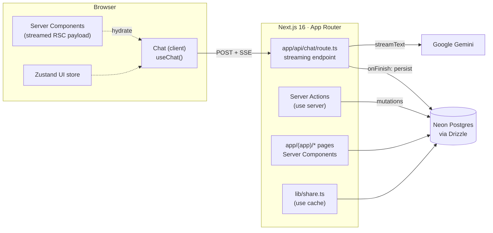
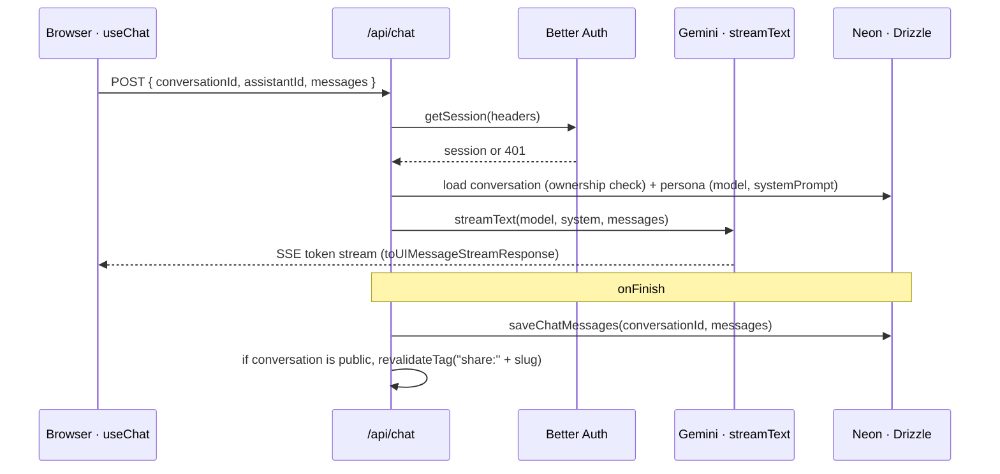
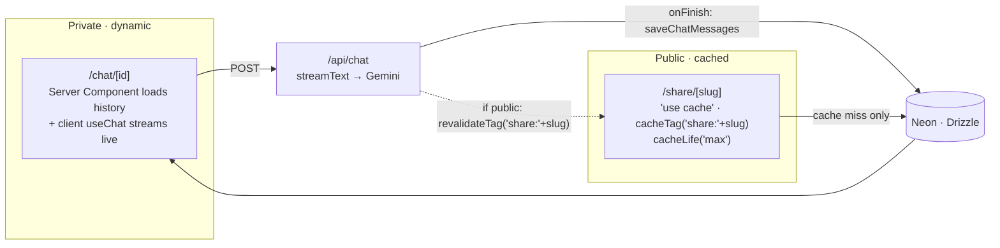
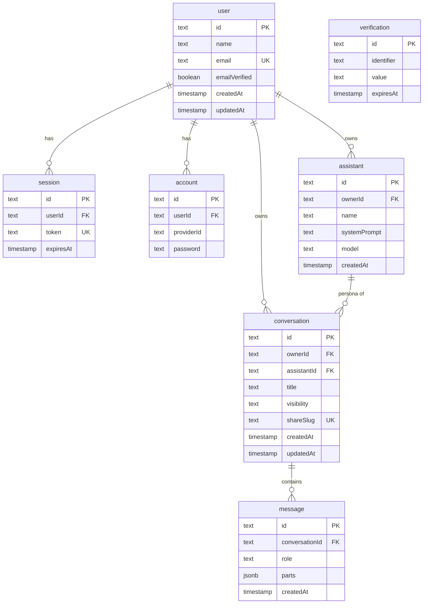

# Atlas

A multi-persona AI chat app. Create AI **assistants**, each with its own system prompt and
model, hold persistent conversations with them, and turn any conversation into a read-only
public link.

Atlas is built around one architecturally interesting problem: the **streaming-vs-cached
boundary**. Live chat must be dynamic and immediate; a shared conversation must be
near-static and durable. Most of the app's structure follows from where that seam sits.

---

## Features

- **Multi-persona assistants.** Each assistant has its own name, system prompt, and model,
  and carries a stable identity color everywhere it appears.
- **Streaming chat.** Tokens stream from Google Gemini straight to the browser.
- **Persistent history.** Every message is saved; conversations resume where you left off.
- **Public share links.** Flip a conversation to public and share a read-only, cached page.
- **Email/password auth.** Per-user data scoping via Better Auth, with its tables in the
  app's own Drizzle schema.
- **Dark-first design system.** OKLCH tokens, a per-persona color derived from the assistant
  id, and a working light theme.

## Tech stack

| Layer | Choice |
|---|---|
| Framework | Next.js 16 (App Router, Cache Components / PPR) |
| UI | React 19, Tailwind CSS v4, `react-markdown` + `remark-gfm` |
| AI | Vercel AI SDK v6 (`ai`, `@ai-sdk/react`) + Google Gemini (`@ai-sdk/google`) |
| Auth | Better Auth (email/password) |
| Database | Neon Postgres + Drizzle ORM (WebSocket serverless driver) |
| Client state | Zustand |

---

## Architecture

### System overview



The browser runs a thin client (`useChat`, a Zustand store for UI state) over
server-rendered history. Mutations go through Server Actions; live generation goes through
a route handler, because streaming cannot live inside a Server Action.

### Chat request flow

Sending a message is the one path that bypasses Server Actions and talks to a route handler
directly, so it can stream.



The freshly streamed message is reconciled on the client by `useChat`, and persisted
server-side in `onFinish`, so a reload re-renders the same thread from the database.

### The streaming-vs-cached boundary

This is the seam the whole app is organized around. Private chat is **dynamic**; the public
share page is **cached until explicitly invalidated**. The chat route is the bridge between
them.



- **`/chat/[id]`** is rendered per request: the Server Component loads history and the
  persona, and the client `<Chat>` streams new tokens over it.
- **`/share/[slug]`** is wrapped in `"use cache"` with a `cacheTag` and `cacheLife("max")`,
  so it serves from cache indefinitely, until the chat route's `revalidateTag` busts exactly
  that slug after a new message lands in a *public* conversation.

### Rendering modes

`next.config.ts` enables `cacheComponents`, which turns on Partial Prerendering. Each route
lands in one of three buckets:

| Route | Mode | Why |
|---|---|---|
| `/`, `/sign-in`, `/sign-up` | Static | No per-request data |
| `/dashboard`, `/assistants/new`, `/chat/[id]`, `/share/[slug]` | Partial Prerender | Static shell + dynamic/cached streamed content under Suspense |
| `/api/chat`, `/api/auth/[...all]`, `/api/health` | Dynamic | Server-rendered on demand |

---

## Database schema

Two halves live in **one** Drizzle schema: the Better Auth tables (`auth-schema.ts`) and the
app's domain tables (`lib/schema.ts`, which re-exports the auth tables so everything is one
graph).



### Domain tables

- **`assistant`** is a persona: `name`, `systemPrompt`, and `model` (defaults to
  `gemini-3.1-flash-lite`), owned by a `user`. It has deliberately **no color column**: the
  identity color is derived from the assistant's `id` at render time (see `lib/persona.ts`),
  so it stays stable across the sidebar, the conversation, and the share page with no
  migration.
- **`conversation`** belongs to a `user` and is tied to one `assistant`. It carries `title`,
  a `visibility` enum (`"private" | "public"`, default private), and a nullable `shareSlug`.
  `updatedAt` auto-touches on write, which drives the "most recent first" sidebar order.
- **`message`** belongs to a `conversation`, with a `role` enum
  (`"user" | "assistant" | "system"`) and `parts` stored as **`jsonb`**. `parts` is the AI
  SDK `UIMessage` shape, so the structure that streams to the browser is exactly what gets
  persisted, and live chat and saved history never diverge.

### Two details worth knowing

- **Cascade chain.** Every foreign key uses `onDelete: "cascade"`:
  `user → assistant → conversation → message`, plus `user → conversation` and
  `user → session/account`. Deleting an assistant takes its conversations and their messages
  with it; deleting a user erases everything they own.
- **`share_slug` is uniquely indexed and nullable.** Unsharing sets it back to `null` (not
  `""`): Postgres treats `NULL`s as distinct in a unique index, so any number of
  conversations can be private at once, while every public slug stays unique.

### Indexes

`assistant.ownerId`, `conversation.ownerId`, and `message.conversationId` are indexed for the
per-user and per-conversation reads the app makes on every screen; `conversation.shareSlug`
has a unique index used to resolve a public link.

---

## Project structure

```
atlas/
├─ app/
│  ├─ (app)/                  # authenticated shell (sidebar + top bar)
│  │  ├─ layout.tsx           # Suspense boundary → <AppShell>
│  │  ├─ dashboard/           # persona roster + start a chat
│  │  ├─ chat/[id]/           # live conversation (streaming)
│  │  └─ assistants/new/      # create a persona
│  ├─ (auth)/                 # sign-in / sign-up
│  ├─ api/
│  │  ├─ chat/route.ts        # streaming endpoint (streamText)
│  │  ├─ auth/[...all]/       # Better Auth handler
│  │  └─ health/
│  ├─ share/[slug]/           # public, cached, read-only view
│  ├─ layout.tsx              # root: fonts, theme class, store provider
│  └─ globals.css             # OKLCH design tokens (dark + light)
├─ components/                # Chat, Sidebar, ConversationToolbar, Markdown, icons, …
├─ lib/
│  ├─ schema.ts               # assistant · conversation · message
│  ├─ queries.ts              # read helpers (server-only)
│  ├─ chat-store.ts           # load / save chat messages
│  ├─ share.ts                # cached share fetch ("use cache")
│  ├─ persona.ts              # per-assistant identity color (derived from id)
│  ├─ actions/                # Server Actions (create/rename/delete, share/unshare)
│  ├─ auth.ts · auth-client.ts
│  └─ db.ts                   # Neon pool (WebSocket driver)
├─ auth-schema.ts             # Better Auth tables (user/session/account/verification)
├─ stores/ui-store.ts         # Zustand (sidebar, mobile nav, theme)
├─ providers/                 # per-request UI store provider
└─ drizzle/ · drizzle.config.ts
```

## Design system

OKLCH design tokens live in `app/globals.css`: dark by default with a class-driven light
theme, near-monochrome chrome with a single amber accent, and a **per-persona hue**
(`lib/persona.ts`) that gives each assistant its own identity color across every surface.
All contrast pairs are verified to WCAG 2.2 AA.

---

## Getting started

### Prerequisites

- Node.js 20+
- A Neon Postgres database
- A Google Generative AI API key

### Setup

```bash
npm install
```

Create a `.env` file in the project root with:

| Variable | Purpose |
|---|---|
| `DATABASE_URL` | Pooled Neon connection string |
| `DATABASE_URL_UNPOOLED` | Direct connection (migrations) |
| `BETTER_AUTH_SECRET` | Auth signing secret |
| `BETTER_AUTH_URL` | App URL (default `http://localhost:3000`) |
| `GOOGLE_GENERATIVE_AI_API_KEY` | Gemini access |

Then push the schema and start the dev server:

```bash
npm run db:push
npm run dev
```

Open [http://localhost:3000](http://localhost:3000), create an account, add an assistant,
and start a conversation.

## Scripts

| Script | Does |
|---|---|
| `npm run dev` | Start the dev server |
| `npm run build` | Production build |
| `npm run start` | Serve the production build |
| `npm run lint` | ESLint |
| `npm run db:push` | Push the Drizzle schema to the database |
| `npm run db:generate` | Generate a migration from schema changes |
| `npm run db:migrate` | Apply migrations |
| `npm run db:studio` | Open Drizzle Studio |
